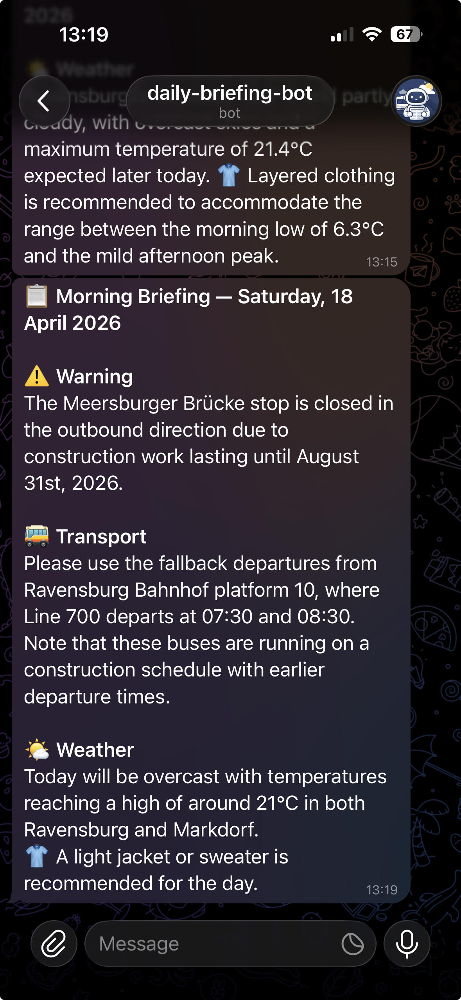
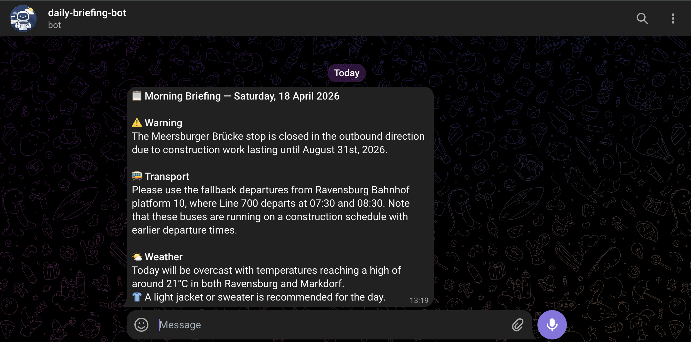

<p align="center">
  
</p>

<h1 align="center">Daily Briefing Bot</h1>

<p align="center">
  A personal automation bot that delivers a daily briefing via Telegram.<br />
  Collects public transport departures and weather forecasts, summarizes them with Google Gemini,<br />
  and sends a concise message — fully automated via GitHub Actions, no server required.
</p>

<p align="center">
  
  &nbsp;&nbsp;&nbsp;
  
  <br /><br />
  <sub>Briefing message on mobile and web</sub>
</p>


## Table of Contents

- [Architecture](#architecture)
- [Project Structure](#project-structure)
- [Getting Started Locally](#getting-started-locally)
- [GitHub Actions Setup](#github-actions-setup)
- [Extending the Bot](#extending-the-bot)
  - [Adding a Data Source](#adding-a-data-source)
  - [Adding a Notifier](#adding-a-notifier)
  - [Swapping the AI Provider](#swapping-the-ai-provider)
- [Tech Stack](#tech-stack)


## Architecture

The bot follows a simple pipeline:

```
GitHub Actions cron
       │
       ▼
  Data Sources (fetch in parallel)
  ├── EFA-BW departure monitor (bus lines)
  └── Open-Meteo weather API
       │
       ▼
  Pipeline (aggregate → summarize → notify)
       │
       ▼
  AI Provider (Google Gemini)
       │
       ▼
  Notifier (Telegram)
```

All external systems are abstracted behind interfaces (`DataSource`, `AIProvider`, `Notifier`), making it straightforward to swap or add implementations without touching the core pipeline.


## Project Structure

```
src/
├── common/
│   └── constants.ts          # Stop IDs, bus lines, locations, system prompt path
├── interfaces/
│   ├── data-source.ts        # DataSource interface
│   ├── ai-provider.ts        # AIProvider interface
│   └── notifier.ts           # Notifier interface
├── sources/
│   ├── efa-bw-departure-source.ts   # Public transport (EFA-BW API)
│   ├── weather-data-source.ts       # Weather (Open-Meteo API)
│   └── web-scraper-source.ts        # Generic HTML scraper (Cheerio)
├── providers/
│   └── gemini-provider.ts    # Google Gemini AI summarization
├── notifiers/
│   └── telegram-notifier.ts  # Telegram Bot API
├── resources/
│   └── system-prompt.txt     # AI system prompt
├── config.ts                 # Feature flags from environment variables
├── pipeline.ts               # Core orchestration (fetch → summarize → notify)
└── index.ts                  # Entry point
tests/
├── integration/              # Real HTTP calls (run nightly)
└── *.test.ts                 # Unit tests (mocked)
.github/workflows/
├── briefing.yml              # Scheduled briefing delivery
├── ci.yml                    # Tests + coverage on push/PR
└── integration.yml           # Nightly integration tests
```


## Getting Started Locally

### Prerequisites

- Node.js (version from `.nvmrc`)
- A Telegram Bot token and chat ID (see [Telegram Setup](#telegram-setup) below)
- A Google AI Studio API key (see [Gemini Setup](#gemini-api-key) below)

### 1. Install dependencies

```bash
npm install
```

### 2. Configure environment variables

Copy the example and fill in your values:

```bash
cp .env.example .env
```

```env
# AI provider
AI_API_KEY=your_gemini_api_key

# Telegram notifier
NOTIFIER_BOT_TOKEN=your_telegram_bot_token
NOTIFIER_CHAT_ID=your_telegram_chat_id

# Run context (set manually for local runs)
RUN_LABEL=Morning

# Dev / testing flags
AI_ENABLED=true               # set to false to skip Gemini and print raw data instead
NOTIFIER_ENABLED=true         # set to false to print briefing to stdout instead of Telegram
LOG_API_RESPONSES=false       # set to true to print each source's raw response to stdout
```

**Tips for local development:**
- Set `AI_ENABLED=false` to skip the Gemini API call and see raw aggregated data in the console
- Set `NOTIFIER_ENABLED=false` to print the briefing to stdout instead of sending it to Telegram
- Combine both to run fully offline (useful for testing new data sources)

### 3. Run

```bash
# Run with ts-node (no build step needed)
npm run dev

# Or build first, then run
npm run build
npm start
```

### 4. Run tests

```bash
npm test                  # unit tests
npm run test:coverage     # unit tests with coverage report
npm run test:integration  # integration tests (makes real HTTP calls)
```

---

### Telegram Setup

1. Open Telegram and search for **@BotFather**
2. Send `/newbot` and follow the prompts to name your bot
3. BotFather will give you a **bot token** — copy it to `NOTIFIER_BOT_TOKEN`
4. Start a conversation with your new bot (send any message)
5. Open this URL in your browser to find your **chat ID**:
   ```
   https://api.telegram.org/bot<YOUR_BOT_TOKEN>/getUpdates
   ```
   Look for `"chat": { "id": ... }` in the response — copy that number to `NOTIFIER_CHAT_ID`

### Gemini API Key

1. Go to [Google AI Studio](https://aistudio.google.com)
2. Sign in with your Google account
3. Click **Get API key** → **Create API key**
4. Copy the key to `AI_API_KEY`

The free tier is sufficient for this project.

---

## GitHub Actions Setup

The bot runs entirely on GitHub Actions — no server required. Three workflows are included:

| Workflow | File | Trigger |
|---|---|---|
| Daily briefing | `briefing.yml` | Cron schedule + manual |
| Unit tests & coverage | `ci.yml` | Push / PR to `main` |
| Integration tests | `integration.yml` | Push / PR to `main` + nightly |

### Schedule

| Cron | Time (Germany) | Days | Content |
|---|---|---|---|
| `10 5 * * 2-4` | 07:10 | Tue–Thu | Transport + Weather |
| `10 14 * * 2-4` | 16:10 | Tue–Thu | Transport + Weather |
| `10 5 * * 0,1,5,6` | 07:10 | Mon, Fri–Sun | Weather only |

### Required Secrets

Add these in **Settings → Secrets and variables → Actions**:

| Secret | Description |
|---|---|
| `AI_API_KEY` | Google Gemini API key |
| `NOTIFIER_BOT_TOKEN` | Telegram Bot token |
| `NOTIFIER_CHAT_ID` | Telegram chat ID to send messages to |

### Manual Trigger

The briefing workflow supports `workflow_dispatch` — trigger it manually from the **Actions** tab in your repository with a custom run label (e.g. `Morning`, `Afternoon`, `Manual`).

---

## Extending the Bot

The bot is designed around three interfaces. Adding new capabilities means implementing one of them and registering it in `src/index.ts`.

### Adding a Data Source

Any class that implements `DataSource` can be added to the pipeline:

```ts
// src/interfaces/data-source.ts
export interface DataSource {
    name: string;
    fetchData(): Promise<string>;
}
```

`fetchData()` must return a plain text string describing the data. The pipeline aggregates all source outputs and passes them to the AI provider, which uses them to generate the briefing.

**Example — a public holiday check:**

```ts
// src/sources/public-holiday-source.ts
import axios from "axios";
import { DataSource } from "../interfaces/data-source";

export class PublicHolidaySource implements DataSource {
    name = "Public Holidays";

    async fetchData(): Promise<string> {
        const year = new Date().getFullYear();
        const response = await axios.get(
            `https://date.nager.at/api/v3/PublicHolidays/${year}/DE`,
            { timeout: 10000 }
        );
        const today = new Date().toISOString().slice(0, 10);
        const holiday = response.data.find((h: { date: string; name: string }) => h.date === today);
        return holiday
            ? `Today is a public holiday: ${holiday.name}`
            : "No public holiday today.";
    }
}
```

Then register it in `src/index.ts`:

```ts
const sources = [
    new PublicHolidaySource(),
    // ... existing sources
];
```

The AI summarizer will automatically include this data. Update `src/resources/system-prompt.txt` if you want the AI to handle the new data in a specific way (e.g. skip transport info on public holidays).

---

### Adding a Notifier

Any class that implements `Notifier` can replace or run alongside Telegram:

```ts
// src/interfaces/notifier.ts
export interface Notifier {
    notify(message: string): Promise<void>;
}
```

The `message` passed to `notify()` is formatted as Telegram HTML (e.g. `<b>bold</b>`). Strip or convert tags if your target channel uses a different format.

**Example — a Discord webhook notifier:**

```ts
// src/notifiers/discord-notifier.ts
import axios from "axios";
import { Notifier } from "../interfaces/notifier";

export class DiscordNotifier implements Notifier {
    private readonly webhookUrl: string;

    constructor() {
        const url = process.env.DISCORD_WEBHOOK_URL;
        if (!url) throw new Error("DISCORD_WEBHOOK_URL is not set");
        this.webhookUrl = url;
    }

    async notify(message: string): Promise<void> {
        // Discord uses plain text — strip HTML tags from Telegram formatting
        const plain = message.replace(/<[^>]+>/g, "");
        await axios.post(this.webhookUrl, { content: plain }, { timeout: 10000 });
    }
}
```

Then swap it in `src/index.ts`:

```ts
const notifier = config.NOTIFIER_ENABLED
    ? new DiscordNotifier()
    : { notify: async (_message: string) => {} };
```

---

### Swapping the AI Provider

Any class that implements `AIProvider` can replace Gemini:

```ts
// src/interfaces/ai-provider.ts
export interface AIProvider {
    summarize(input: string, systemPrompt: string): Promise<string>;
}
```

**Example — an OpenAI provider:**

```ts
// src/providers/openai-provider.ts
import OpenAI from "openai";
import { AIProvider } from "../interfaces/ai-provider";

export class OpenAIProvider implements AIProvider {
    private readonly client: OpenAI;

    constructor() {
        this.client = new OpenAI({ apiKey: process.env.AI_API_KEY });
    }

    async summarize(input: string, systemPrompt: string): Promise<string> {
        const response = await this.client.chat.completions.create({
            model: "gpt-4o-mini",
            messages: [
                { role: "system", content: systemPrompt },
                { role: "user", content: input },
            ],
        });
        return response.choices[0].message.content ?? "";
    }
}
```

Then swap it in `src/index.ts`:

```ts
const aiProvider = config.AI_ENABLED
    ? new OpenAIProvider()
    : { summarize: async (data: string) => data };
```

---

## Tech Stack

- **TypeScript** + Node.js
- **Vitest** — unit and integration tests
- **Axios** — HTTP client (10s timeout on all calls, with automatic retry)
- **Cheerio** — HTML parsing for the web scraper source
- **Google Gemini API** — AI summarization
- **Telegram Bot API** — delivery channel
- **Open-Meteo API** — weather data (no API key required)
- **EFA-BW API** — public transport departures (Baden-Württemberg)
- **GitHub Actions** — scheduling and execution (no server required)
